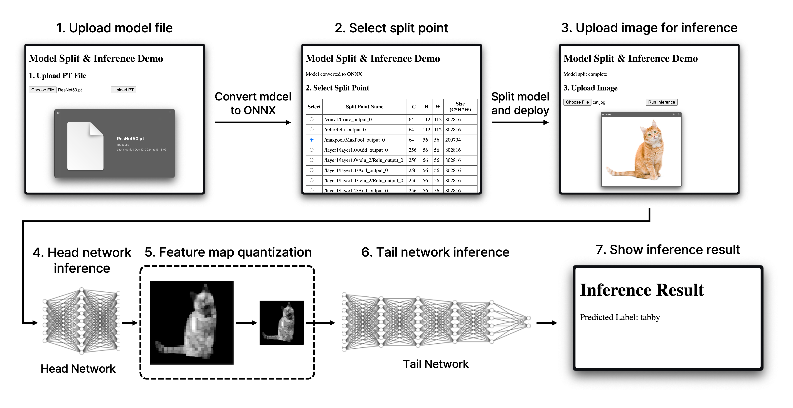
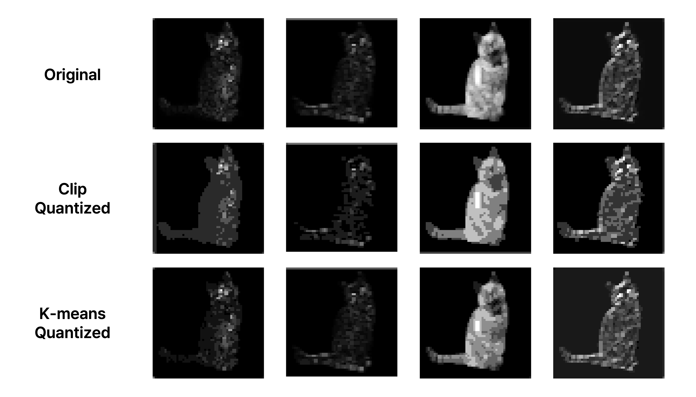

A.EdgeAI-Split-Computing
========================
A.EdgeAI-Split-Computing is a framework designed for the **split execution of deep learning models** between autonomous robots and edge servers. The system optimizes **computational efficiency**, reduces **latency**, and ensures **network traffic minimization** by leveraging distributed AI computing techniques.




Applied Techniques and Theoretical Background
---------------------------------------------
**1. ONNX Runtime for Model Execution**
   - **Overview**:
     ONNX Runtime is an optimized inference engine designed to execute AI models in a lightweight and cross-platform manner.
   - **In This Project**:
     - Models converted to ONNX format are executed both on the robot (head) and edge server (tail) using ONNX Runtime.
     - Lightweight execution is ensured, even on resource-constrained environments like Jetson AGX Orin.

**2. Model Splitting**
   - **Overview**:
     Model splitting involves partitioning a neural network into "head" and "tail" segments, with computation divided between a robot and an edge server.
   - **In This Project**:
     - PyTorch models are converted to ONNX format for compatibility.
     - Split points are identified based on network graph analysis, focusing on minimizing the size of intermediate feature maps transmitted between devices.
     - ONNX utilities are employed to dynamically extract head and tail models.

**3. Feature Map Quantization**
   - **Overview**:
     Quantization reduces the precision of numerical data (e.g., from 32-bit floating point to 4-bit integers) to minimize the data size while maintaining inference accuracy.
   - **In This Project**:
     - **Clip-based Quantization**:
       - Clips feature maps to a fixed range (e.g., 0–32) before scaling them to a lower bit representation (4-bit).
       - Balances compression efficiency and data fidelity.
     - The quantized feature maps are serialized into binary strings for transmission and later deserialized for inference on the edge server.




Technologies Used
-----------------
- **Frameworks**: FastAPI, Docker, ONNX Runtime
- **AI Tools**: PyTorch, ONNX
- **Networking**: REST APIs, Binary Serialization for Feature Maps
- **Hardware**:
  - **Robot**: NVIDIA Jetson AGX Orin
  - **Edge Server**: Dell Alienware Aurora R16 (Intel i9-14900KF, NVIDIA RTX 4090)


Repository Structure
--------------------
```
A.EdgeAI-Split-Computing
├── common  # Shared utilities for inference and quantization.
│   ├── __init__.py
│   ├── inference.py
│   └── quantization.py
│
├── model_splitter  # Tools for converting, splitting, and testing AI models.
│   ├── __init__.py
│   ├── app.py
│   ├── model_ops.py
│   ├── preprocessing.py
│   ├── saved_models
│   ├── static
│   ├── templates
│   │   ├── index.html
│   │   └── inference.html
│   └── uploaded_images
│
├── edge_inference  # Code for running the tail model and postprocessing.
│   ├── __init__.py
│   ├── app.py
│   ├── imagenet_class_index.json
│   └── postprocessing.py
│
├── robot_inference  # Code for running the head model and quantization.
│   ├── __init__.py
│   └── app.py
│
├── Dockerfile_edge_inference
├── Dockerfile_model_splitter
├── Dockerfile_robot_inference
└── docker-compose.yml
```


Installation and Usage
----------------------
1. Clone the Repository:
```bash
$ git clone https://github.com/Open-Edge-Robotics/A.EdgeAI-Split-Computing.git
$ cd A.EdgeAI-Split-Computing
```

2. Build and Run Docker Containers
Ensure that **Docker** and **Docker Compose** are installed on your system. Run the following command to build and start the necessary containers:

```bash
$ docker-compose up --build
```

3. Access the Model Splitter UI:
Open your browser and navigate to http://localhost:8000 to interact with the Model Splitter web interface.

4. Run the Inference Test Pipeline:
Upload a model, select a split point, and upload an image to test the inference.

