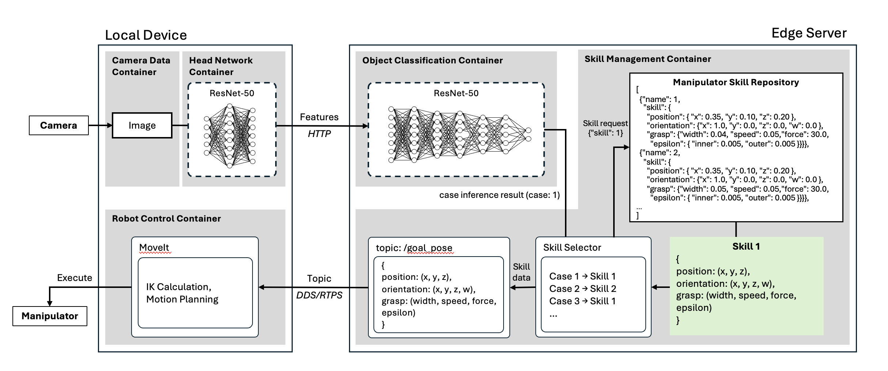

A.EdgeAI-Split-Computing
========================

A.EdgeAI-Split-Computing is a framework designed for the **split execution of deep learning models** between autonomous robots and edge servers. The system optimizes **computational efficiency**, reduces **latency**, and ensures **network traffic minimization** by leveraging distributed AI computing techniques.

Demo Video
----------

